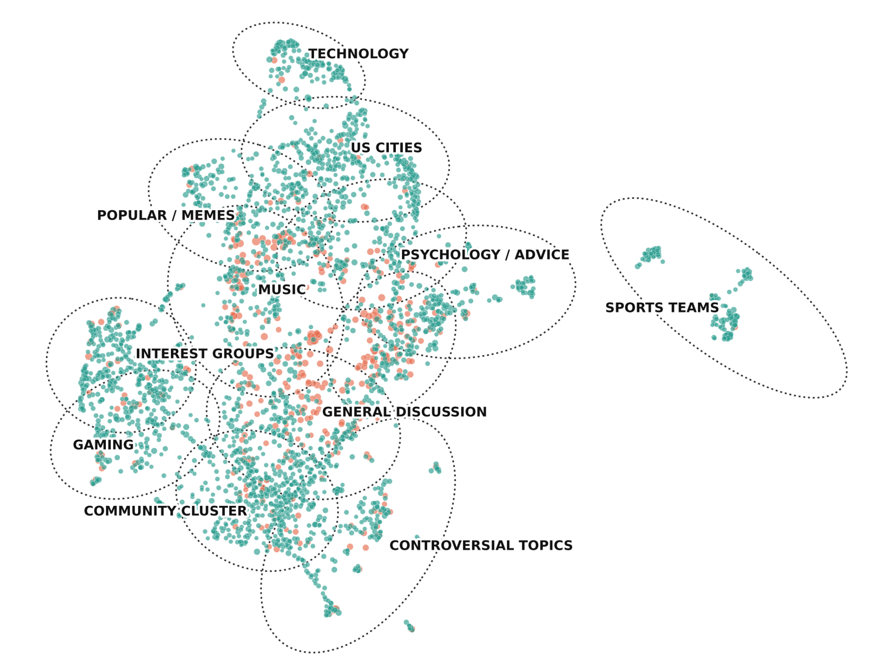
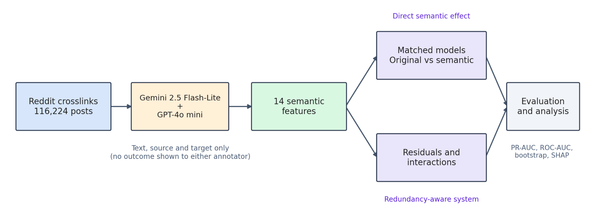
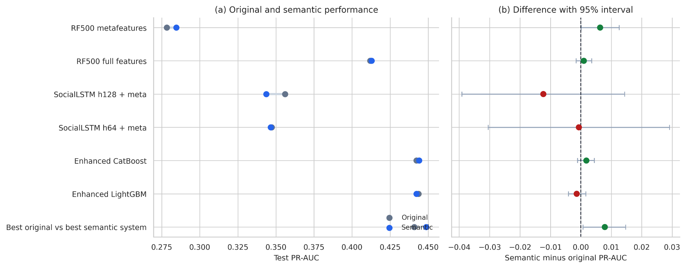
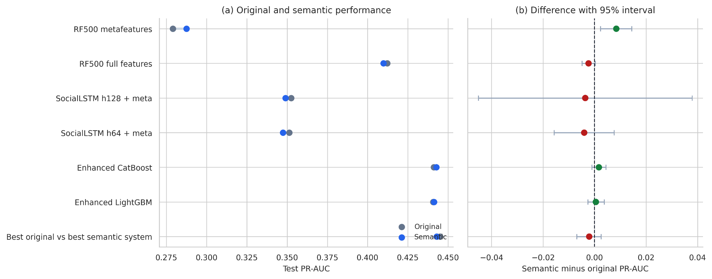
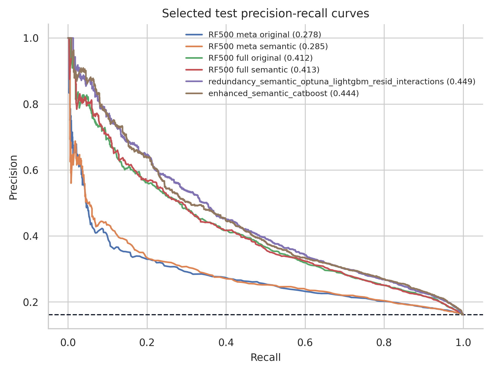

# Semantic Edge Enrichment with Large Language Models for Improved Inter-Community Conflictb Prediction in Reddit

We use LLM-derived semantic labels to improve and explain inter-community conflict prediction in Reddit cross-community links. We revisit the Stanford SNAP Reddit Hyperlink Network conflict-prediction setting and ask whether simple plain-language semantic labels can add useful predictive signal beyond the original handcrafted, social, graph, and text features.

We annotate all **116,224** crosslink entries with two LLM annotators: **Gemini 2.5 Flash-Lite** and **GPT-4o mini**. Each annotator sees only the recovered post text, source subreddit, target subreddit, and a non-outcome text-quality flag. We hide the outcome label, train/validation/test split, future behavior, target-derived features, and model predictions from the annotators.

Our main conclusion is that semantic enrichment is useful, but not automatic. Semantic labels improve the simple RF500 metafeature baseline for both annotators. In feature-rich models that already use LSTM, social, graph, and metafeature representations, gains are smaller because many semantic labels are already predictable from the original features. The strongest result comes from the Gemini-based redundancy-aware semantic system.

---

## Repository Layout

We keep this repository intentionally simple. We use one large README instead of separate documentation files. This README contains the project description, notebook order, data-access notes, reproducibility notes, software/API notes, figure explanations, table summaries, citation text, and responsible-use notes.

```text
.
├── README.md
├── notebooks/
│   ├── 01_semantic_annotation_gemini25_flashlite_full_dataset.ipynb
│   ├── 02_semantic_annotation_gpt4o_mini_full_dataset.ipynb
│   ├── 03_model_training_evaluation_gemini25_flashlite_semantics.ipynb
│   └── 04_model_training_evaluation_gpt4o_mini_semantics.ipynb
└── figures/
    ├── fig01_reddit_community_space.png
    ├── fig02_semantic_enrichment_pipeline.png
    ├── fig03a_gemini_pr_auc_values_and_deltas.png
    ├── fig03b_gpt4o_mini_pr_auc_values_and_deltas.png
    └── fig04_selected_precision_recall_curves_gemini.png
```

We do not include separate `requirements.txt`, `environment.yml`, `LICENSE`, `CITATION.cff`, `.gitignore`, `paper/`, `data/`, `results/`, or `docs/` files in this minimal release. The relevant information is consolidated here.

---

## Paper and Project Summary

**Paper title:** Semantic Edge Enrichment for Inter-Community Conflict Prediction in Reddit  
**Author:** Ha Viet Thang  
**Affiliation:** FPT University, Can Tho, Vietnam  
**Contact:** havietthang@acm.org

We study whether explicit semantic labels help predict whether a Reddit cross-community link will be followed by conflict or mobilization. We use the original Reddit conflict-prediction setting introduced by Kumar, Hamilton, Leskovec, and Jurafsky, and we preserve the original train/validation/test split.

We add two independent LLM semantic-enrichment layers:

1. Gemini 2.5 Flash-Lite semantic annotations.
2. GPT-4o mini semantic annotations.

For each annotator, we compare original models against semantic-augmented models under matched architectures. We also evaluate redundancy-aware semantic-aware models that use raw semantic labels, residualized semantic features, semantic-original interactions, and validation-selected gradient boosting.

---

## Data Sources and Artifact Access

We do not redistribute the original Reddit corpus as our own data. The original Reddit conflict-prediction corpus should be obtained from the Stanford SNAP project pages.

| Resource | Role in this project |
|---|---|
| [SNAP Reddit Hyperlink Network](https://snap.stanford.edu/data/soc-RedditHyperlinks.html) | Source of the directed subreddit-to-subreddit hyperlink network and related subreddit representations. |
| [SNAP Community Interaction and Conflict on the Web](https://snap.stanford.edu/conflict/) | Source of the original conflict-prediction task, target definition, and project context. |
| Generated semantic annotations and benchmark outputs | We release generated semantic labels, model predictions, metrics, tables, figures, and supporting outputs keyed to original identifiers. |

In the paper draft, we list the generated semantic annotations and experimental outputs as available on Kaggle:

[semantic-enrichment-conflict-prediction-in-reddit](https://www.kaggle.com/datasets/michaelhafpt/semantic-enrichment-conflict-prediction-in-reddit)

The released artifact stores generated semantic labels and experimental outputs keyed to original example identifiers. We do not claim ownership over the original Reddit corpus.

---

## Notebook Order

Run the notebooks in this order.

| Step | Notebook | Purpose | Suggested Colab runtime |
|---:|---|---|---|
| 1 | `01_semantic_annotation_gemini25_flashlite_full_dataset.ipynb` | Generate or resume Gemini 2.5 Flash-Lite semantic annotations for the full corpus. | Standard Colab CPU is enough because annotation uses an API; High-RAM is safer for loading and merging data. |
| 2 | `02_semantic_annotation_gpt4o_mini_full_dataset.ipynb` | Generate or resume GPT-4o mini semantic annotations for the full corpus. | Standard Colab CPU is enough because annotation uses an API; High-RAM is safer for loading and merging data. |
| 3 | `03_model_training_evaluation_gemini25_flashlite_semantics.ipynb` | Train and evaluate original and Gemini-semantic models; generate Gemini tables and figures. | Colab A100 High-RAM preferred; L4/T4 can work but may be slower. |
| 4 | `04_model_training_evaluation_gpt4o_mini_semantics.ipynb` | Train and evaluate original and GPT-semantic models; generate GPT tables and figures. | Colab A100 High-RAM preferred; L4/T4 can work but may be slower. |

We recommend running the annotation notebooks first, then the model notebooks. The annotation notebooks save outputs incrementally so interrupted Colab sessions can resume instead of restarting from zero.

---

## Expected Local or Google Drive Layout

The notebooks were developed around a Google Drive project folder. A typical Colab layout is:

```text
/content/drive/MyDrive/csonet2026_conflict_prediction/
├── tokenized_posts.tsv
├── post_crosslinks_info.tsv
├── glove_word_embeds.txt
├── original_split_ids_extracted.csv
├── recovered_text_original_splits.parquet
├── crosslink_post_target_map.parquet
└── results/
    ├── llm_semantic_enrichment_gemini_2_5_flash_lite_boolean_v5_full_dataset/
    ├── llm_semantic_enrichment_openai_gpt4o_mini_boolean_v5_full_dataset/
    ├── model_training_gemini_semantics/
    └── model_training_gpt4o_mini_semantics/
```

If a notebook uses a different folder name, update the `PROJECT_ROOT` or equivalent path variable near the beginning of the notebook.

---

## Software and API Notes

We do not include `requirements.txt` or `environment.yml` in this minimal repository. The notebooks install or import the packages they need inside notebook cells.

Typical packages used across the notebooks include:

| Area | Packages |
|---|---|
| Data processing | `pandas`, `numpy`, `pyarrow`, `tqdm` |
| Machine learning | `scikit-learn`, `lightgbm`, `xgboost`, `catboost`, `optuna` |
| Neural models | `torch` |
| Interpretation | `shap` |
| Plotting | `matplotlib` |
| LLM APIs | OpenAI API client, Google Gemini API client |

For API notebooks, set keys through Colab secrets or environment variables. Do not hard-code API keys inside notebooks.

Common environment variable names:

```bash
OPENAI_API_KEY=...
GOOGLE_API_KEY=...
GEMINI_API_KEY=...
```

---

## Dataset and Prediction Target

Each example is a directed Reddit crosslink from a source community to a target community. The prediction target is not simply whether the source post sounds negative. A positive example means the crosslink is followed by conflict or mobilization in the original dataset construction: source-side users are mobilized to participate negatively in the target-side community.

We preserve the original train/validation/test split throughout the experiments. The held-out validation and test splits are imbalanced, with a positive rate of about 16%. We therefore use PR-AUC as the main selection and interpretation metric, while also reporting ROC-AUC.

The figure below is supporting material for the dataset description. We use it only as descriptive context. Coral nodes indicate communities that initiate more negative cross-community links; teal nodes indicate other communities. Topic outlines are visual guides only and are not used as model features.



### Table 1. Semantic Coverage by Annotator

Split membership follows the original train/validation/test assignment.

| Annotator | Train | Validation | Test | Total paired | Missing |
|---|---:|---:|---:|---:|---:|
| Gemini | 93,659 | 11,261 | 11,257 | 116,177 | 47 |
| GPT-4o mini | 93,696 | 11,264 | 11,264 | 116,224 | 0 |

---

## Leakage-Controlled Semantic Annotation

We annotate each crosslink using only recovered post text, source community, target community, and a non-outcome text-quality flag. The annotators do not receive the mobilization target, burst label, future behavior, model predictions, test metrics, post-outcome information, or split membership.

Each model returns one primary label, seven independent boolean attributes, and a short audit reason. The short reason is used for inspection only and is not used as a predictive feature. The predictive semantic representation contains 14 features: seven boolean columns and seven one-hot primary-label columns.

The figure below is supporting material for the annotation protocol. It summarizes the leakage-controlled pipeline from Reddit crosslinks to semantic features, matched model comparisons, residuals/interactions, and evaluation.



### Primary Label Options

| Primary label |
|---|
| `neutral_information_reference` |
| `negative_grievance_reference` |
| `audience_directed_engagement_reference` |
| `norm_violation_reference` |
| `cross_community_comparison_reference` |
| `supportive_or_defensive_reference` |
| `unclear_or_other` |

### Boolean Semantic Indicators

| Boolean label | Meaning |
|---|---|
| `neutral_information_reference` | Ordinary informational reference. |
| `negative_grievance` | Complaint, hostile evaluation, accusation, ridicule, or outrage. |
| `audience_directed_engagement` | Appeal to readers to look, judge, respond, vote, report, visit, or participate. |
| `norm_violation_framing` | Claim that rules, expectations, moderation norms, or social norms were violated. |
| `cross_community_comparison` | Explicit comparison between communities, groups, or audiences. |
| `intergroup_boundary_framing` | In-group/out-group framing, sides, camps, insiders, outsiders, or identities. |
| `supportive_or_defensive_framing` | Defense or support of a group, user, moderator, position, action, or discussion. |

### Compact Annotation Prompt

```text
System role:
You are a careful research annotator for a computational social science study.
Label a Reddit cross-community post for semantic mechanisms related to community
mobilization and conflict prediction. Output ONLY valid JSON.

Leakage controls:
Use only recovered title/body text, source subreddit, target subreddit, and the
non-outcome text-quality flag. Do not use or infer outcome label, split,
future behavior, model prediction, target-derived features, confidence,
probability, intensity, severity, or any numeric judgment.

Primary label, choose exactly one:
neutral_information_reference;
negative_grievance_reference;
audience_directed_engagement_reference;
norm_violation_reference;
cross_community_comparison_reference;
supportive_or_defensive_reference;
unclear_or_other.

Independent boolean labels:
negative_grievance;
audience_directed_engagement;
norm_violation_framing;
cross_community_comparison;
intergroup_boundary_framing;
supportive_or_defensive_framing;
neutral_information_reference.

Per-row prompt:
Source community: {source_subreddit}
Target community: {target_subreddit}
Recovered text quality: {text_quality_flag}
Recovered text: {text_for_llm}
Return JSON with primary_label, seven booleans, and short_reason.
```

---

## Models and Evaluation Protocol

We evaluate semantic enrichment at two levels.

### Matched Original vs Semantic Models

In matched comparisons, each original model is paired with a semantic version using the same post IDs and the same architecture. The only difference is whether semantic features are included.

| Model family | Why we include it |
|---|---|
| RF500 metafeatures | Tests whether semantic labels help when the base model has only handcrafted original metafeatures. |
| RF500 full features | Tests whether semantic labels still help after adding richer original features. |
| SocialLSTM-style models | Tests semantic enrichment with socially primed recurrent representations. |
| Enhanced boosted tree models | Tests semantic augmentation under stronger feature-rich tabular learners. |

### Redundancy-Aware Semantic-Aware Models

We also train semantic-aware models that combine original full features, raw semantic labels, semantic residuals, semantic-original interactions, and validation-selected gradient boosting. The motivation is that semantic labels may already be encoded indirectly in text, social, or graph representations.

For each semantic label `s_j`, an auxiliary model predicts the label from the original full representation `x`:

```text
s_hat_j = f_j(x)
```

The residualized semantic feature is:

```text
r_j = s_j - s_hat_j
```

The residual is intended to capture semantic information not already predictable from the original representation. Targeted interactions allow semantic labels to matter conditionally on strong original features.

### Evaluation Rules

We preserve the original split, use validation PR-AUC for model selection, and evaluate the test split only after selection. F1 thresholds are chosen on validation predictions and then applied unchanged to the test split. For deterministic tabular models, uncertainty intervals use paired bootstrap resampling over held-out test examples. For LSTM models, we run multiple random seeds where applicable to estimate seed stability.

---

## Main Results

### Table 2. Main PR-AUC Results by Annotator

RF500 rows measure matched direct semantic augmentation. Semantic-aware rows compare validation-selected original and semantic-aware models.

| Annotator | Comparison | Original PR-AUC | Semantic PR-AUC | Δ PR-AUC |
|---|---|---:|---:|---:|
| Gemini | RF500 metafeatures | 0.2782 | 0.2846 | +0.0063 |
| GPT-4o mini | RF500 metafeatures | 0.2790 | 0.2874 | +0.0084 |
| Gemini | Semantic-aware model | 0.4408 | 0.4487 | +0.0079 |
| GPT-4o mini | Semantic-aware model | 0.4450 | 0.4429 | -0.0021 |

Both annotators improve the RF500 metafeature baseline. This is the cleanest direct semantic gain: adding low-dimensional semantic labels helps when the base model has only handcrafted metafeatures. The feature-rich semantic-aware result differs by annotator: Gemini improves PR-AUC after residualization and interactions, while GPT-4o mini does not improve PR-AUC in the analogous semantic-aware setting.

The two figures below support this result section. We keep them next to the table because they show the PR-AUC values and semantic-minus-original deltas for the matched and semantic-aware comparisons.





### Table 3. Selected Original Versus Semantic-Aware Models on the Held-Out Test Split

Each pair is selected by validation PR-AUC before test evaluation.

| Annotator | Model | ROC-AUC | PR-AUC | F1 |
|---|---|---:|---:|---:|
| Gemini | Selected original model | 0.7706 | 0.4408 | 0.3391 |
| Gemini | Semantic-aware model | 0.7720 | 0.4487 | 0.4363 |
| GPT-4o mini | Selected original model | 0.7708 | 0.4450 | 0.4278 |
| GPT-4o mini | Semantic-aware model | 0.7723 | 0.4429 | 0.4308 |

For Gemini, the semantic-aware PR-AUC improvement is positive with paired-bootstrap 95% interval `[0.0007, 0.0147]` and approximate `p = 0.029`. For GPT-4o mini, the semantic-aware PR-AUC delta is negative and the interval crosses zero, `[-0.0069, 0.0026]`, with approximate `p = 0.398`. For the GPT-4o mini RF500 metafeature baseline, the direct PR-AUC gain is positive with interval `[0.0023, 0.0144]` and approximate `p = 0.008`.

The precision-recall curve below supports the PR-AUC comparisons for representative Gemini original and semantic models. We emphasize PR-AUC because conflict examples are uncommon.



---

## Why Feature-Rich Models Gain Less

Semantic labels do not always produce larger gains because of redundancy. If original full features can already predict the semantic labels, then adding those labels provides limited new information. Several semantic labels are highly predictable from the original full representation, which suggests that original text, social, and learned features already encode much of the information that the semantic labels make explicit.

### Table 4. Semantic Label Predictability from Original Full Features

High predictability indicates redundancy with the original representation.

| Semantic label | Gemini ROC-AUC | GPT-4o mini ROC-AUC |
|---|---:|---:|
| Intergroup Boundary Framing | 0.894 | 0.909 |
| Norm Violation Framing | 0.900 | 0.897 |
| Negative Grievance | 0.872 | 0.885 |
| Audience Directed Engagement | 0.785 | 0.842 |
| Supportive Or Defensive Framing | 0.839 | 0.825 |
| Cross Community Comparison | 0.790 | 0.814 |
| Neutral Information | 0.814 | 0.810 |

Grouped SHAP analysis supports the same conclusion. The semantic-aware models primarily rely on LSTM embeddings, social embeddings, and metafeatures. Raw semantic labels contribute little directly once those richer original representations are present. Semantic interactions and residuals contribute more than raw labels, but their total contribution remains small relative to the original learned and social feature groups.

---

## Reproducibility Checklist

To reproduce the reported workflow, we use this order:

1. Obtain the original Reddit conflict-prediction files from SNAP.
2. Place the required original files in the expected Google Drive or local project directory.
3. Run the Gemini semantic annotation notebook, or use the released Gemini semantic annotations.
4. Run the GPT-4o mini semantic annotation notebook, or use the released GPT semantic annotations.
5. Run the Gemini training/evaluation notebook.
6. Run the GPT-4o mini training/evaluation notebook.
7. Compare the generated tables and figures against the values summarized in this README.

Expected core outputs include:

| Output type | Expected content |
|---|---|
| Semantic annotations | Full-corpus Gemini and GPT-4o mini primary labels, boolean labels, and audit reasons. |
| Model predictions | Held-out validation and test predictions for original and semantic models. |
| Metrics tables | ROC-AUC, PR-AUC, F1, precision, recall, bootstrap intervals, and selected-model summaries. |
| Figures | The five paper figures stored in `figures/`. |

---

## Figure File Manifest

These are the only figure files expected in the minimal paper-reproduction repo.

| Paper figure | File | Used in this README section |
|---|---|---|
| Fig. 1 | `figures/fig01_reddit_community_space.png` | Dataset and Prediction Target |
| Fig. 2 | `figures/fig02_semantic_enrichment_pipeline.png` | Leakage-Controlled Semantic Annotation |
| Fig. 3 top | `figures/fig03a_gemini_pr_auc_values_and_deltas.png` | Main Results |
| Fig. 3 bottom | `figures/fig03b_gpt4o_mini_pr_auc_values_and_deltas.png` | Main Results |
| Fig. 4 | `figures/fig04_selected_precision_recall_curves_gemini.png` | Main Results |

If the figures do not render on GitHub, check that the `figures/` folder is committed at the repository root and that the filenames match this manifest exactly.

---

## Citation

If you use this repository or the generated semantic annotations, please cite the paper:

```bibtex
@inproceedings{thang2026semanticedge,
  title     = {Semantic Edge Enrichment for Inter-Community Conflict Prediction in Reddit},
  author    = {Ha Viet Thang},
  booktitle = {Proceedings of CSoNet 2026},
  year      = {2026},
  note      = {Code and generated semantic annotations released for reproducibility}
}
```

Please also cite the original Reddit conflict-prediction work and SNAP data pages when using the underlying task or corpus.

---

## Responsible Use

We release this artifact for research reproduction, model comparison, and aggregate analysis of online community dynamics. We do not recommend using the models for automatic punishment of users or communities. The semantic labels are LLM-generated annotations, not human gold labels or causal explanations. Any applied moderation use should include human review, platform-specific validation, and careful consideration of false positives.

---

## Summary of Main Findings

We find that semantic enrichment helps most clearly when the base model has limited semantic access. Both Gemini and GPT-4o mini improve the RF500 metafeature baseline. In feature-rich settings, the semantic labels are partly redundant with original text, social, graph, and learned representations. The best Gemini semantic-aware model improves ROC-AUC, PR-AUC, and F1 over the selected original system, while the analogous GPT-4o mini semantic-aware model improves ROC-AUC and F1 slightly but does not improve PR-AUC. The main lesson is that semantic enrichment is valuable, but it must be modeled carefully rather than added automatically.
